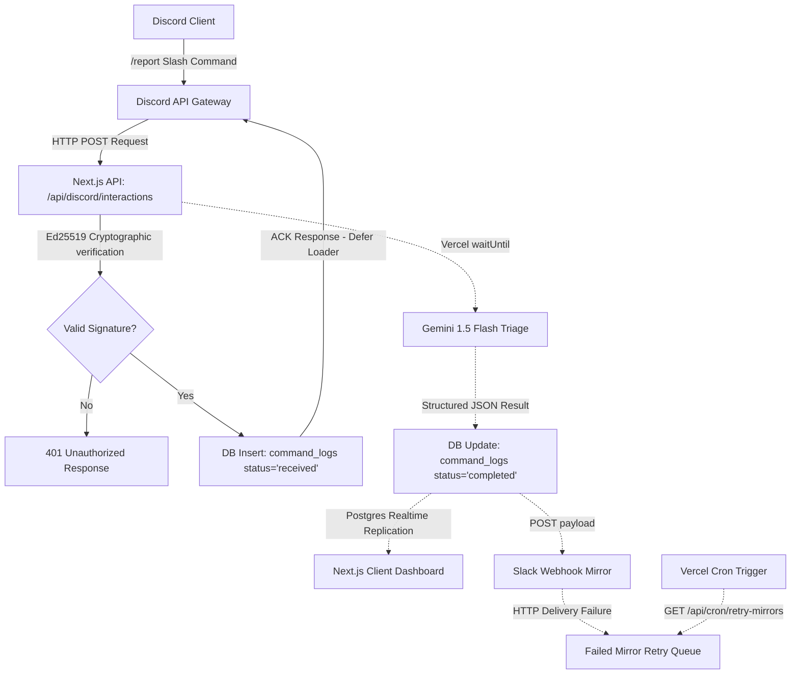
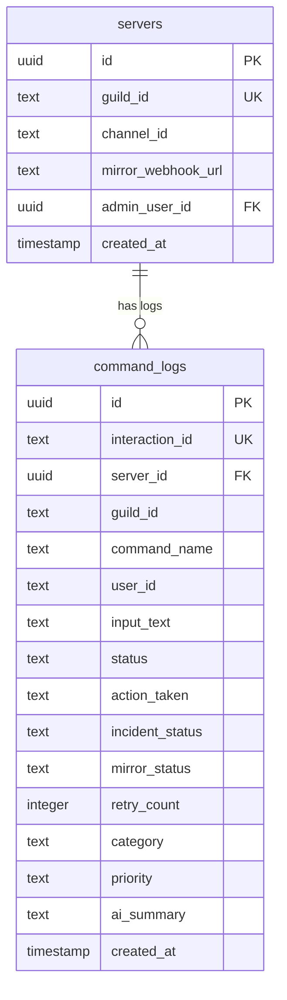

# ⬣ RelayOps — Architectural Specifications & Codebase Documentation

This document serves as a comprehensive, developer-focused guide to the RelayOps codebase. It outlines the design patterns, data flows, database schemas, AI triage pipelines, and component relationships built into the system.

---

## 1. Project Overview & Business Logic

### Core Functionality
RelayOps is a **Real-Time ChatOps Incident Management & Automation Platform**. It is designed to act as the central dispatcher for operational anomalies. The system connects a **Discord ChatOps Interface** directly with **Google Gemini AI**, **Slack Webhooks**, and a **Real-Time Web Admin Dashboard**.

### The Business Problem Solved
During production incidents, team reaction latency is the single largest contributor to High MTTR (Mean Time To Resolution). RelayOps solves this by:
1. **Meeting developers where they work**: Allowing engineers to trigger incident triage directly within Discord chats via `/report`.
2. **Automating Triage via LLMs**: Leveraging Google Gemini to automatically classify, prioritize, and summarize incident descriptions in seconds.
3. **Synchronizing Stakeholders**: Mirroring the AI-triaged incident status immediately to dedicated Slack operational channels.
4. **Providing a Single Pane of Glass**: Broadcasting changes in real-time to a secure admin dashboard where supervisors can track metrics, search logs, and resolve incidents.

### High-Level Architecture


---

## 2. Technology Stack & Decision Matrix

| Technology | Role in Platform | Why Chosen? | Key Code References |
| :--- | :--- | :--- | :--- |
| **Next.js 14 (App Router)** | Full-stack application runner & routing engine | Supports fast API routes, Edge compatibility, server components, and dynamic route processing. | [layout.tsx](file:///C:/Users/DELL/Downloads/RelayOps/app/layout.tsx), [route.ts](file:///C:/Users/DELL/Downloads/RelayOps/app/api/discord/interactions/route.ts) |
| **React 18** | Client UI rendering & reactive state engine | Standard for reactive layouts, supporting custom hooks, client-side rendering, and Framer Motion hooks. | [page.tsx](file:///C:/Users/DELL/Downloads/RelayOps/app/dashboard/page.tsx) |
| **Supabase** | PostgreSQL engine & Realtime change data capture (CDC) | Eliminates database pooling complications via HTTP REST endpoints, provides built-in user authentication, and streams live changes natively over WebSockets. | [admin.ts](file:///C:/Users/DELL/Downloads/RelayOps/lib/supabase/admin.ts), [client.ts](file:///C:/Users/DELL/Downloads/RelayOps/lib/supabaseClient.ts) |
| **Google Gemini (1.5 Flash)** | Automated incident classification & summarization | Very low latency model with state-of-the-art unstructured text extraction. Triages reports in <1.5s. | [triage.ts](file:///C:/Users/DELL/Downloads/RelayOps/lib/ai/triage.ts) |
| **discord-interactions** | Signature validation | Official cryptographic library containing utility functions to verify Ed25519 signatures securely. | [verify.ts](file:///C:/Users/DELL/Downloads/RelayOps/lib/discord/verify.ts) |
| **Tailwind CSS** | Styling utility system | Enables clean theme variable mappings and dynamic utility styling without compile-time CSS bloat. | [globals.css](file:///C:/Users/DELL/Downloads/RelayOps/app/globals.css) |

---

## 3. Directory Layout & Folder Interactions

```
RelayOps/
├── app/                  # Next.js App Router root
│   ├── api/              # API Route Handlers (Discord webhooks, Cron Jobs, auth)
│   ├── dashboard/        # Dashboard layout, subpages (Overview, Analytics, Activity, Settings)
│   ├── login/            # Admin authentication entry page
│   ├── layout.tsx        # HTML wrapper root layout
│   └── page.tsx          # Home page route (dynamic server-side redirect)
├── components/           # Reusable frontend UI components
│   ├── dashboard/        # Metric cards, charts, activity feeds, hero headers
│   └── ui/               # Theme toggles and provider wrapper structures
├── lib/                  # Shared utilities and logic layers
│   ├── ai/               # Gemini API configuration and prompt triage logic
│   ├── commands/         # ChatOps Slash Command executables and query handlers
│   ├── discord/          # Cryptographic validation and response builders
│   ├── notifications/    # Slack incoming webhook notifications logic
│   ├── supabase/         # Server-side and RLS-bypassing admin database clients
│   └── supabaseClient.ts # standard client and configuration exports
├── scripts/              # Command registration, diagnostics, and mock testing CLI tools
└── supabase/             # Relational SQL schemas and migrations
```

### Folder Interactions Matrix
* **`app/api/discord/interactions/route.ts`** imports validation logic from **`lib/discord/`**, passes inputs to command dispatchers in **`lib/commands/`**, inserts metrics via client configurations in **`lib/supabase/`**, triages descriptions via **`lib/ai/`**, and triggers webhooks configured in **`lib/notifications/`**.
* **`app/dashboard/page.tsx`** renders widgets imported from **`components/dashboard/`** and connects a realtime websocket listener utilizing client tools from **`lib/supabaseClient.ts`**.

---

## 4. Key File Specifications

### [app/page.tsx](file:///C:/Users/DELL/Downloads/RelayOps/app/page.tsx)
* **Purpose**: Redirects users navigating to the root domain (`/`).
* **Responsibilities**: Runs on the server (`force-dynamic`). Uses cookie sessions to immediately redirect logged-in users to `/dashboard` and unauthenticated users to `/login`.
* **Exported Functions**: `Home()` (Default React component).
* **Dependencies**: `createServerClientInstance` from `@/lib/supabase/server`, `redirect` from `next/navigation`.

### [middleware.ts](file:///C:/Users/DELL/Downloads/RelayOps/middleware.ts)
* **Purpose**: Root routing gatekeeper.
* **Responsibilities**: intercepting Next.js requests (excluding statics/favicons). Triggers session updates via Supabase cookies. If a user without a session accesses `/dashboard/*`, redirects to `/login`. If an authenticated user hits `/login`, redirects to `/dashboard`.
* **Exported Functions**: `middleware(request)`, `config` (matcher configuration).

### [lib/supabase/admin.ts](file:///C:/Users/DELL/Downloads/RelayOps/lib/supabase/admin.ts)
* **Purpose**: Bypasses Row Level Security (RLS) policies for server-side execution.
* **Responsibilities**: Utilizes `SUPABASE_SERVICE_ROLE_KEY` to connect as the super-admin. Wrapped inside a Javascript **Proxy** to prevent build-time initialization crashes on Vercel if keys are undefined during static page generation.
* **Exported Values**: `supabaseAdmin` (Proxy typed as `SupabaseClient`).

### [app/api/discord/interactions/route.ts](file:///C:/Users/DELL/Downloads/RelayOps/app/api/discord/interactions/route.ts)
* **Purpose**: Discord webhook receiver.
* **Responsibilities**:
  1. Cryptographically verifies request headers (`x-signature-ed25519`).
  2. Acknowledges ping checks (`type: 1`).
  3. Inserts initial logs with `status: 'received'`.
  4. Spawns asynchronous tasks via Vercel `waitUntil` to run Gemini triage, update command logs, trigger Slack webhooks, and patch Discord replies.

---

## 5. System Execution Lifecycle

```
[User triggers /report in Discord]
              ↓
  [Discord sends Webhook POST]
              ↓
[verifyDiscordRequest() verifies Ed25519 signature]
              ↓
    [Insert log as 'received']
              ↓
  [Respond with 200 ACK Loader]
              ↓
   [Vercel waitUntil spawns] ──(Asynchronous background thread)
              ↓
  [Gemini AI returns triage JSON]
              ↓
[Update DB log as 'completed' with Priority/Category]
              ↓
   [Replication triggers CDC] ──(Supabase WebSocket alerts Dashboard UI)
              ↓
    [POST notification to Slack]
              ↓
[PATCH original Discord message with Resolve Button]
```

---

## 6. API Route Register

### `POST /api/discord/interactions`
* **Route**: `/api/discord/interactions`
* **Method**: `POST`
* **Request Body**: Raw Discord interaction payload containing `type`, `data`, `guild_id`, `member`, and `token`.
* **Validation**: Cryptographic signature validation via `verifyDiscordRequest`.
* **Processing**: Inserts `command_logs` row. Spawns `handleReportCommand` or `handleStatusCommand` asynchronously. Patches replies back to Discord.
* **Response**: `200 OK` (with deferred interaction loader or message JSON).

### `GET /api/cron/retry-mirrors`
* **Route**: `/api/cron/retry-mirrors`
* **Method**: `GET`
* **Validation**: Verifies Vercel Cron `Authorization: Bearer <CRON_SECRET>` headers.
* **Processing**: Fetches up to 20 failed logs (where `mirror_status = 'failed'` and `retry_count < 5`). Queries server webhooks, retries POST deliveries, and increments retry counts.
* **Response**: JSON summary of processed retries, success count, and fail count.

---

## 7. Database Specifications & RLS Settings



### Row Level Security (RLS) Settings
Supabase RLS is fully enabled on `servers` and `command_logs` tables. 

* **`servers` Policy (`server_owner_policy`)**:
  Allows reads, updates, and inserts only if `auth.uid() = admin_user_id`.
* **`command_logs` Policy (`command_logs_owner_policy`)**:
  Restricted to `FOR SELECT` queries only where the logged `server_id` or `guild_id` belongs to a server managed by the authenticated administrator (`auth.uid()`).
* **Bypass Design**: Webhooks and cron routes execute anonymously. They must bypass RLS by invoking the `supabaseAdmin` client which authenticates via the `SUPABASE_SERVICE_ROLE_KEY`.

---

## 8. AI Triaging Architecture (Gemini 1.5 Flash)

The triage engine ([lib/ai/triage.ts](file:///C:/Users/DELL/Downloads/RelayOps/lib/ai/triage.ts)) takes unstructured incident reports and structures them.

### Prompts Pipeline
We leverage Gemini's system instruction capabilities to enforce schema adherence:
```
You are an expert systems engineer. Analyze the following incident report.
You must output a valid JSON object matching this TypeScript interface:
interface TriageResult {
  category: 'Infrastructure' | 'Backend' | 'Database' | 'Network' | 'Authentication' | 'Frontend' | 'Other';
  priority: 'Low' | 'Medium' | 'High';
  summary: string; // Max 120 chars summarizing root problem
}
```

### Triage Pipeline Lifecycle
```
[Unstructured report input]
            ↓
[Gemini generation (JSON schema constraints)]
            ↓
  [Parse raw response string]
            ↓
  alt Valid JSON parsed?
    → Yes: Return TriageResult object
    → No: Trigger Fallback parser (regex extraction)
  else Fallback parser fails?
    → Return safe default: { category: 'Other', priority: 'Medium', summary: '...' }
  end
```

---

## 9. Frontend Unified Layout System

Next.js App router leverages a nested rendering layout.

### Component Structure
```
[RootLayout] (app/layout.tsx)
    └── [DashboardLayout] (app/dashboard/layout.tsx) - Wraps in ThemeProvider
            ├── [DashboardSidebar] (app/dashboard/sidebar.tsx) - Shared Navigation & ThemeToggle
            └── [Page Component] (Overview / Analytics / Settings)
```

### Real-Time Client Subscriptions
The Overview page handles updates by opening a PostgreSQL Realtime subscription to the `command_logs` table:
```typescript
const channel = supabase
  .channel('dashboard-live-logs')
  .on('postgres_changes', { event: '*', schema: 'public', table: 'command_logs' }, (payload) => {
    // Process new log updates dynamically in memory
    if (payload.eventType === 'INSERT') setLogs(prev => [payload.new, ...prev]);
    else if (payload.eventType === 'UPDATE') setLogs(prev => prev.map(l => l.id === payload.new.id ? payload.new : l));
  })
  .subscribe();
```

---

## 10. Design Patterns Utilized

1. **Proxy Pattern**: Used in `lib/supabase/admin.ts` to lazily instantiate the Supabase admin client. This ensures `createClient` is only called at runtime when database methods are accessed, fully resolving Vercel build-time crashes.
2. **Adapter/Wrapper Pattern**: Used in `lib/supabase/server.ts` to adapt Next.js cookie stores to Supabase SSR client interfaces.
3. **Observer Pattern**: Implemented via Supabase Realtime subscriptions to push database updates to connected browser clients over WebSockets.
4. **Command Dispatcher Pattern**: Webhook routes check `data.name` and route execution to specific slash command handler methods (`handleReportCommand`, `handleStatusCommand`).

---

## 11. Interview Guide: Explaining RelayOps

### Key Module: The Webhook Signature Validator
* **What it does**: Ensures that HTTP posts targeting `/api/discord/interactions` are verified using cryptographic Ed25519 signatures.
* **Why it exists**: Anyone could POST fake incident data to your server without authentication. Discord signs every webhook header with your bot's public key to verify authenticity.
* **Common Interview Question**: *"Why did you read the raw request text instead of using JSON parser middleware directly?"*
* **Ideal Answer**: *"Cryptographic signature verification requires the exact, unaltered raw request body. Parsing the body to JSON before checking signatures can introduce subtle whitespace shifts, causing the Ed25519 cryptographic hash verification to fail."*

### Key Module: The RLS Security Model
* **What it does**: Restricts access to data logs at the database level.
* **Common Interview Question**: *"How did you handle the fact that Discord commands execute anonymously, yet dashboard screens require strictly secured customer partitions?"*
* **Ideal Answer**: *"We enabled Row Level Security on Postgres. The web dashboard authenticates clients via cookies, checking auth.uid() owner policies. For Discord integrations which run unauthenticated, we developed a server-side admin client using the Supabase Service Role Key. This secure backend connection bypasses RLS rules, allowing automated logging of ChatOps events."*

---

## 12. Complete Learning Roadmap

To master the architecture of RelayOps, study the modules in this order:

* **Stage 1: System Integrations & Signature Verification**
  - Read [lib/discord/verify.ts](file:///C:/Users/DELL/Downloads/RelayOps/lib/discord/verify.ts) to understand cryptographic handshakes.
  - Read [app/api/discord/interactions/route.ts](file:///C:/Users/DELL/Downloads/RelayOps/app/api/discord/interactions/route.ts) to inspect webhook lifecycles.
* **Stage 2: Database clients & RLS Policies**
  - Read [supabase/schema.sql](file:///C:/Users/DELL/Downloads/RelayOps/supabase/schema.sql) to check tables, indexes, and policy filters.
  - Read [lib/supabase/admin.ts](file:///C:/Users/DELL/Downloads/RelayOps/lib/supabase/admin.ts) to understand the lazy Proxy pattern.
* **Stage 3: AI Triage & Parsing**
  - Read [lib/ai/triage.ts](file:///C:/Users/DELL/Downloads/RelayOps/lib/ai/triage.ts) to study Gemini generation prompts and JSON extractors.
* **Stage 4: Real-Time dashboard rendering**
  - Read [app/dashboard/page.tsx](file:///C:/Users/DELL/Downloads/RelayOps/app/dashboard/page.tsx) to study dynamic change listener wiring.
