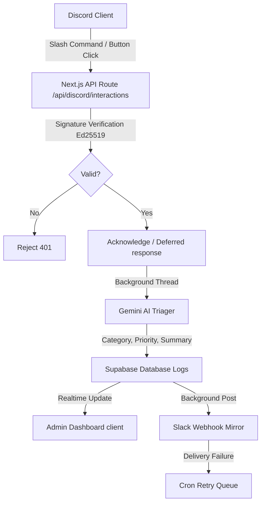

# Incident Manager

Incident Manager is a premium real-time incident reporting and monitoring platform. It combines a Discord slash-command bot with an administrative dashboard to allow users to report issues directly in Discord, triage them automatically via Gemini AI, mirror notifications to Slack, and track system status live.

---

## 1. System Architecture



* **Discord Webhooks:** Receives command interactions securely, performs Ed25519 cryptographic signature checks, acknowledges the request within the 3-second window, and spawns background tasks to execute AI triaging and Slack mirroring.
* **Gemini Triage:** Categorizes incoming report messages (Infrastructure, Backend, Database, Authentication, etc.), assigns priority (High, Medium, Low), and generates concise issue summaries.
* **Slack Mirroring Queue:** Employs a Vercel Cron-triggered retry queue to guarantee message delivery, automatically retrying failed posts up to 5 times.
* **RLS Secured Dashboard:** Employs PostgreSQL Row Level Security to isolate data configurations per administrator, and renders real-time stream feeds using Supabase postgres subscriptions.

---

## 2. Environment Variables (`.env.local`)

Create a `.env.local` file in the root directory and define the following variables:

```bash
# Discord Bot Credentials (Discord Developer Portal -> General Information & Bot)
DISCORD_PUBLIC_KEY=your_discord_public_key_here
DISCORD_BOT_TOKEN=your_discord_bot_token_here
DISCORD_APPLICATION_ID=your_discord_application_id_here

# Supabase Credentials (Supabase Project Settings -> API)
NEXT_PUBLIC_SUPABASE_URL=https://your_project_id.supabase.co
NEXT_PUBLIC_SUPABASE_ANON_KEY=your_supabase_anon_key_here
SUPABASE_SERVICE_ROLE_KEY=your_supabase_service_role_key_here

# Gemini API Key (Google AI Studio)
GEMINI_API_KEY=your_gemini_api_key_here

# Vercel Cron Secret (Generated string to protect the cron endpoint)
CRON_SECRET=your_vercel_cron_secret_here
```

---

## 3. Local Installation & Development

### Prerequisite: Discord Webhook Tunneling
Because Discord sends commands directly to your application over HTTP, you must expose your local development server to the internet using a tunneling tool (such as `ngrok` or `zrok`):
```bash
# Start your local tunnel pointing to your Next.js port
ngrok http 3000
```
Copy the forwarding HTTPS URL (e.g. `https://random-subdomain.ngrok-free.app`) and append `/api/discord/interactions` to set the **Interactions Endpoint URL** in your Discord Application settings.

### Run Locally
```bash
# 1. Install dependencies
npm install

# 2. Run database migration script (optional - run SQL from supabase/retry_count_migration.sql)
# Apply tables and columns schema.sql directly in the Supabase SQL editor.

# 3. Register Slash Commands globally
npx tsx scripts/register-commands.ts

# 4. Start Next.js Development Server
npm run dev
```

---

## 4. Deployment & Supabase Setup

### Database & RLS Initialization
1. Paste the contents of [schema.sql](file:///c:/Users/DELL/Downloads/RelayOps/supabase/schema.sql) in your Supabase SQL editor and execute it to create all tables and RLS policies.
2. Apply the Phase 5 column alter patch in [retry_count_migration.sql](file:///c:/Users/DELL/Downloads/RelayOps/supabase/retry_count_migration.sql) to add the retry queue trackers.
3. Enable email signups in your Supabase Authentication panel.

### Vercel Deployment & Cron Setup
1. Deploy the Next.js project to Vercel and connect your environment variables in Vercel Project Settings (ensure `CRON_SECRET` matches your configuration).
2. The [vercel.json](file:///c:/Users/DELL/Downloads/RelayOps/vercel.json) file schedules the retry queue execution. By default, it is set to `"0 0 * * *"` (once per day) to comply with Vercel's Hobby Tier cron frequency limits. If your project is on Vercel Pro, change the schedule expression to `"*/5 * * * *"` to poll for failures every 5 minutes.

---

## 5. End-to-End Verification Steps
1. **Connect Server:** Navigate to the Web UI dashboard `/dashboard/settings` and enter your Discord Channel ID and Slack Webhook URL.
2. **Execute Command:** In your Discord server, run `/report text: "Authentication server is throwing 500 errors when users try to log in from EU regions"`.
3. **Verify Triage & Slack:**
   * Watch the bot reply with a deferred loader, followed by the Gemini-triaged category (Authentication), priority (High), and summary.
   * Confirm a Slack notification message is sent to your channel containing the formatted incident card.
4. **Interactive Resolution:**
   * Click the **Resolve** button in the Discord notification.
   * Verify the Discord message updates to show "✅ Resolved" (and the button is removed).
   * Confirm the overview dashboard live stream timeline increments stats and marks the incident status "Resolved" in real-time.

---

## 6. Known Limitations
* **Single Active Server Config:** The system expects one configured Discord server per administrator user. Adding multiple servers under a single email session is not fully isolated in the settings panel.
* **Hobby Plan Cron Delay:** On Vercel Hobby plans, cron jobs execute a maximum of once per day. Webhook retry queues will run daily instead of every 5 minutes.
* **Latency Measurements:** Execution response latency tracking is not implemented. Latency distribution panels display an empty state.
