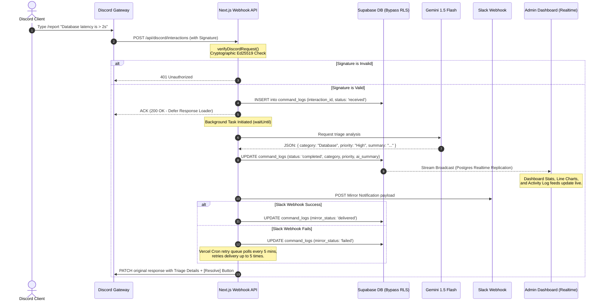

# ⬣ RelayOps — AI-Driven Incident Management Platform

[](https://nextjs.org/)
[](https://www.typescriptlang.org/)
[](https://supabase.com/)
[](https://discord.com/developers/docs/intro)
[](https://deepmind.google/technologies/gemini/)

RelayOps is a premium, enterprise-grade, real-time incident reporting and automation platform. It seamlessly bridges communication between **Discord ChatOps**, **Google Gemini AI**, **Slack notification channels**, and a **Real-Time Admin Dashboard** to triage, log, and resolve production outages instantaneously.

---

## 1. System Architecture & Lifecycle



---

## 2. Platform Capabilities

- ⚡ **Cryptographic Webhook Verification**: High-performance Ed25519 signature checks using `discord-interactions` ensure webhook endpoints only process authentic requests originating from Discord servers.
- 🧠 **AI-Powered Incident Triage**: Automatically analyzes incident reports with **Gemini 1.5 Flash**, categorizing the problem (Database, Auth, Network, etc.), assigning priority level, and generating structured summaries.
- 🔄 **Slack Mirroring & Retry Queue**: Direct webhook mirroring of logs to Slack channels. Includes a robust background cron retry mechanism utilizing **Vercel Crons** that attempts to redeliver failed webhooks up to 5 times.
- 📊 **Real-time Live Dashboard**: Real-time Postgres change tracking streams updates directly to overview metric grids, Priority distributions, and command log history without full page refreshes.
- 🔒 **Row Level Security (RLS) Isolation**: Comprehensive database insulation ensures system configurations are secure and dashboard feeds are strictly scoped to verified server administrators.
- 🌓 **Adaptive Theming System**: A unified layout architecture featuring a smooth Framer Motion-based Theme Toggle. Supports high-contrast light and dark modes with glassmorphic dashboards.

---

## 3. Database Schema (`supabase/schema.sql`)

RelayOps uses three core relational tables in the public schema of Supabase:

### `servers`
Stores Discord guilds connected to RelayOps and their Slack integration webhooks.
| Column | Type | Constraints | Description |
| :--- | :--- | :--- | :--- |
| `id` | `UUID` | `PRIMARY KEY, DEFAULT gen_random_uuid()` | Unique identifier |
| `guild_id` | `TEXT` | `UNIQUE, NOT NULL` | Discord Guild (Server) ID |
| `channel_id` | `TEXT` | `NOT NULL` | Configured text channel ID |
| `mirror_webhook_url` | `TEXT` | `NULLABLE` | Slack Incoming Webhook URL |
| `admin_user_id` | `UUID` | `REFERENCES auth.users(id)` | Associated Admin UID |
| `created_at` | `TIMESTAMPTZ`| `DEFAULT now()` | Creation timestamp |

### `command_logs`
Logs slash command interactions, triage properties, Slack mirroring status, and resolutions.
| Column | Type | Constraints | Description |
| :--- | :--- | :--- | :--- |
| `id` | `UUID` | `PRIMARY KEY, DEFAULT gen_random_uuid()` | Unique log ID |
| `interaction_id` | `TEXT` | `UNIQUE, NOT NULL` | Discord Interaction ID |
| `server_id` | `UUID` | `REFERENCES servers(id)` | Server association |
| `guild_id` | `TEXT` | `NULLABLE` | Target Guild ID |
| `command_name` | `TEXT` | `NOT NULL` | Invoked command (e.g. `/report`) |
| `user_id` | `TEXT` | `NOT NULL` | Discord User ID |
| `input_text` | `TEXT` | `NULLABLE` | Raw input text parameter |
| `status` | `TEXT` | `NOT NULL` | `'received' \| 'completed' \| 'failed'` |
| `action_taken` | `TEXT` | `NULLABLE` | `'created_report' \| 'status_lookup'` |
| `incident_status` | `TEXT` | `NULLABLE` | `'open' \| 'resolved'` |
| `mirror_status` | `TEXT` | `NULLABLE` | `'pending' \| 'delivered' \| 'failed'` |
| `retry_count` | `INTEGER` | `DEFAULT 0` | Slack notification retries |
| `category` | `TEXT` | `NULLABLE` | AI-triaged incident category |
| `priority` | `TEXT` | `NULLABLE` | AI-triaged priority level |
| `ai_summary` | `TEXT` | `NULLABLE` | AI-generated issue summary |

---

## 4. Local Installation & Development

### 1. Prerequisite: Tunneling Webhooks
Since Discord sends interactive events to HTTP URLs, you must expose your local development environment using a tunnel (e.g., `ngrok` or `zrok`):
```bash
# Point a public HTTPS tunnel to your Next.js port
ngrok http 3000
```
Copy the generated HTTPS URL (e.g., `https://xxxx-xx-xxx.ngrok.io`) and append `/api/discord/interactions` to set the **Interactions Endpoint URL** in your Discord Application settings.

### 2. Environment Variables (`.env.local`)
Create a `.env.local` file in the root directory:
```bash
# Discord Credentials (Discord Developer Portal -> General Info & Bot)
DISCORD_PUBLIC_KEY=your_discord_public_key_here
DISCORD_BOT_TOKEN=your_discord_bot_token_here
DISCORD_APPLICATION_ID=your_discord_application_id_here

# Supabase API Configuration (Supabase Settings -> API)
NEXT_PUBLIC_SUPABASE_URL=https://your_supabase_project.supabase.co
NEXT_PUBLIC_SUPABASE_ANON_KEY=your_anon_key_here
SUPABASE_SERVICE_ROLE_KEY=your_service_role_key_here

# Google Gemini API Key (Google AI Studio)
GEMINI_API_KEY=your_gemini_api_key_here

# Cron Security Secret (Secure random alphanumeric string)
CRON_SECRET=your_cron_secret_here
```

### 3. Setup Project
```bash
# 1. Install dependencies
npm install

# 2. Register Discord Slash Commands globally
# (Make sure Application ID and Bot Token are loaded in env)
npx tsx scripts/register-commands.ts

# 3. Start Next.js server locally
npm run dev
```

---

## 5. Deployment Setup

### Supabase Initialization
1. Paste the SQL query in [supabase/schema.sql](file:///C:/Users/DELL/Downloads/RelayOps/supabase/schema.sql) in your **Supabase SQL Editor** and execute it to set up tables and RLS.
2. Paste the SQL migration from [supabase/retry_count_migration.sql](file:///C:/Users/DELL/Downloads/RelayOps/supabase/retry_count_migration.sql) to add retry columns.

### Vercel Cron Configuration
The application leverages [vercel.json](file:///C:/Users/DELL/Downloads/RelayOps/vercel.json) to schedule automatic redeliveries of failed notifications:
* On **Vercel Hobby** plans, the frequency defaults to `"0 0 * * *"` (once per day).
* On **Vercel Pro** plans, you can update this to `"*/5 * * * *"` (every 5 minutes) for high-performance failover polling:
  ```json
  {
    "crons": [
      {
        "path": "/api/cron/retry-mirrors",
        "schedule": "*/5 * * * *"
      }
    ]
  }
  ```

---

## 6. Verification & Troubleshooting

### 🧑‍💻 Diagnostics Tools
The repository features two built-in scripts to verify your deployments:
* **Environment Diagnostics**: Checks missing environment variables and tests connections to Supabase.
  ```bash
  npx tsx scripts/diagnose-env.ts
  ```
* **Adversarial / Mock Integration Testing**: Simulates Discord request handshakes and processes mock reports to test Gemini parsing and database entries without running the Discord bot.
  ```bash
  npx tsx scripts/adversarial-tests.ts
  ```

### 🚨 Common Errors
* **`Error code: 42501 (new row violates row-level security policy)`**
  * *Reason*: The server-side API (e.g. Discord interactions or cron job) is attempting to write to Supabase using the anonymous key `NEXT_PUBLIC_SUPABASE_ANON_KEY`.
  * *Resolution*: Ensure these routes utilize the RLS-bypassing `supabaseAdmin` client imported from `@/lib/supabase/admin`, which utilizes `SUPABASE_SERVICE_ROLE_KEY`.
* **`Failed to collect page data for /api/cron/retry-mirrors` during Vercel Build**
  * *Reason*: The database client was initialized at module-level and failed to parse undefined environment variables at build-time.
  * *Resolution*: The `supabaseAdmin` client utilizes a lazy JS `Proxy` wrapper which defers client instantiation entirely to runtime property access.
