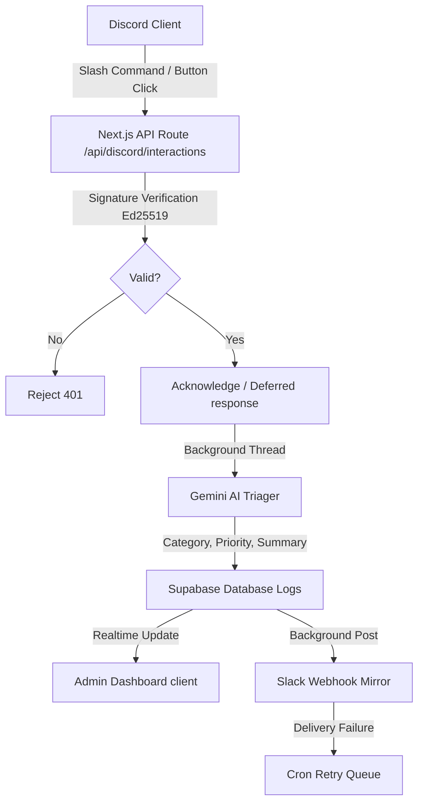

# Incident Manager - Project Overview & Technical Architecture

"Incident Manager" is a premium, real-time Discord slash-command bot and administrative dashboard web application. It automates incident report logging, triages reports with Gemini AI, mirrors notifications to Slack, and provides a secure admin dashboard.

---

## 1. Technical Stack
* **Framework:** Next.js 14+ (App Router, React server/client components, route middleware).
* **Language:** TypeScript.
* **Database & Auth:** Supabase (PostgreSQL, Row Level Security (RLS), Auth sessions, and PostgreSQL Realtime subscriptions).
* **Styling:** Tailwind CSS, shadcn/ui custom primitives, dark theme, violet accents.
* **Hosting/Serverless:** Vercel (Edge runtime compatibilities, Serverless functions, Vercel Cron Jobs).

---

## 2. System Architecture & Flows

---

## 3. Database Schema (`supabase/schema.sql`)

* **`servers` Table:** Stores configurations linking a Discord server (guild) and Slack channels.
  * `id` (UUID, Primary Key)
  * `guild_id` (TEXT, Unique) — Discord Server ID.
  * `channel_id` (TEXT) — Targeted Discord Channel for logging.
  * `mirror_webhook_url` (TEXT) — Slack Webhook URL.
  * `admin_user_id` (UUID, References auth.users) — Admin owner.
* **`command_logs` Table:** Interaction telemetry and triage outcomes.
  * `id` (UUID, Primary Key)
  * `interaction_id` (TEXT, Unique) — Prevents duplicate processing.
  * `guild_id` (TEXT, references servers.guild_id)
  * `command_name` (TEXT) — `/report`, `/status`, or `resolve_click`.
  * `user_id` (TEXT) — Discord User ID.
  * `input_text` (TEXT, Nullable) — Input description.
  * `status` (TEXT) — `'received' | 'completed' | 'failed'`
  * `incident_status` (TEXT, Nullable) — `'open' | 'resolved'`
  * `category` / `priority` / `ai_summary` (TEXT, Nullable) — Triage output from Gemini.
  * `mirror_status` (TEXT, Nullable) — `'pending' | 'delivered' | 'failed' | 'abandoned'`
  * `retry_count` (INTEGER, Default 0) — Queue tracker for Slack retry runs.
* **RLS Policies:** All tables have RLS enabled. Selects/writes on `servers` and reads on `command_logs` are scoped strictly to `auth.uid() = admin_user_id`. Webhook routes run under the Supabase Service Role client (`SUPABASE_SERVICE_ROLE_KEY`) to log data across servers.

---

## 4. Backend Logic & Endpoints

* **Interactions Route (`app/api/discord/interactions/route.ts`):**
  * Verifies requests using Ed25519 signature validation.
  * Handles `/status` and `/report` commands.
  * Implements **Deferred Responses** (returns a pending state to Discord within 3 seconds, then processes background AI triage and PATCHes the final response using the interaction token).
  * Appends a interactive **"Resolve" Button component** to Discord incident notifications. Clicking this sends a component interaction, resolves the log in the database, and updates the Discord message.
* **Gemini Triage Service (`lib/ai/triage.ts`):**
  * Invokes the Gemini 1.5 Flash model with strict JSON output matching:
    `{ category: string, priority: "High" | "Medium" | "Low", summary: string }`.
  * Handles timeouts (8 seconds) and fallbacks to ensure Discord receives responses even if the AI service fails.
* **Slack Mirror (`lib/notifications/slack.ts`):**
  * Forwards incident information to the configured Slack Webhook asynchronously.
* **Cron Retry Queue (`app/api/cron/retry-mirrors/route.ts`):**
  * Triggered every 5 minutes by Vercel Cron.
  * Queries failed Slack notifications (max 20 per execution), retries the POST, and increments the retry count. Logs are marked `abandoned` after 5 failures to prevent infinite loops. Protected via `CRON_SECRET` Bearer header validation.

---

## 5. Frontend Dashboard & Pages

* **Overview (`/dashboard`):** Real-time monitoring hub.
  * **Hero Header:** Displays personalized greeting and counts active, open reports.
  * **Telemetry Cards:** Shows dynamic values (Commands Today, Open Incidents, Slack Mirror Success Rate, AI Classified metrics) with 24h activity sparklines.
  * **Realtime Command Timeline:** Subscribed to Supabase events. Updates instantly when slash commands or button resolutions are executed.
  * **AI Insights Panel & Health Panel:** Shows priority trends and service health states (checked dynamically against server parameters).
* **Analytics (`/dashboard/analytics`):**
  * **Command Volume Chart:** area chart (Total commands vs Slack mirrors).
  * **Category Ratios:** percentage bar graph.
  * **Hourly Activity Heatmap:** 24h x 7d block grid.
  * **Success/Failure Bar Chart** & **Top Command Rank list**.
  * **Latency Distributions:** displays a clean empty state card since latency telemetry is disabled on this tier.
* **Activity Log (`/dashboard/activity`):**
  * Full list of command logs with pagination (15 rows per page).
  * Live search input (matches user ID or input text).
  * Filter dropdowns (date range, incident status, execution success).
  * Slide-out details drawer showing payload, AI summary, category, priority, and Slack retry stats.
* **Settings (`/dashboard/settings`):** Configures Discord channel ID and Slack mirror webhook URL (RLS scoped).
* **Login (`/login`):** Supabase email auth layout.
